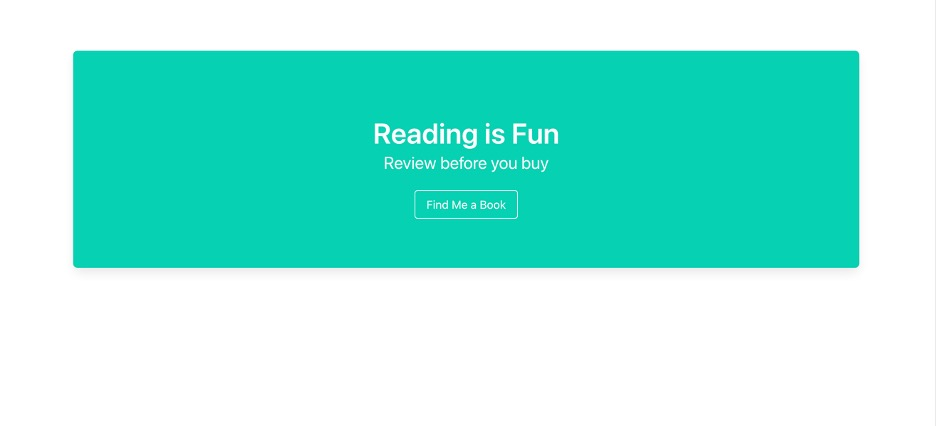
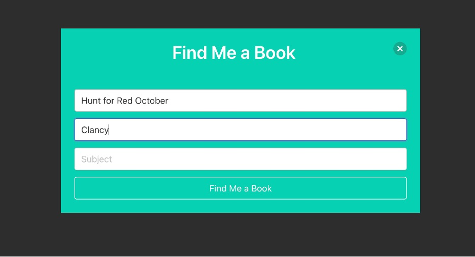
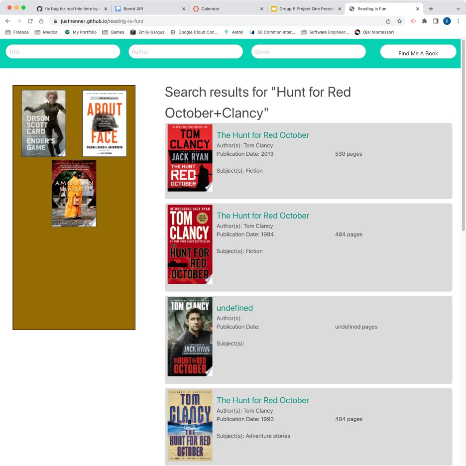
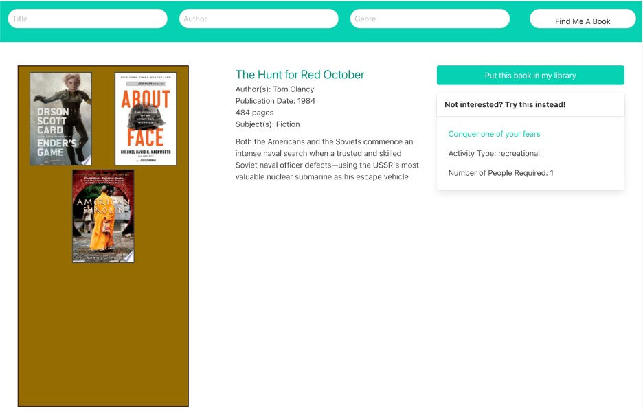

# Reading Is Fun 

## Technology Used 

| Technology Used         | Resource URL           | 
| ------------- |:-------------:| 
| HTML    | [https://developer.mozilla.org/en-US/docs/Web/HTML](https://developer.mozilla.org/en-US/docs/Web/HTML) | 
| CSS     | [https://developer.mozilla.org/en-US/docs/Web/CSS](https://developer.mozilla.org/en-US/docs/Web/CSS)      |   
| Bulma   | [https://bulma.io/](https://bulma.io/) |
| JavaScript | [https://git-scm.com/](https://git-scm.com/)     |    
| UmbrellaJS | [https://umbrellajs.com/](https://umbrellajs.com/) |
| Google Books API | [https://developers.google.com/books](https://developers.google.com/books) |
| Bored API | [https://www.boredapi.com/](https://www.boredapi.com/) |

 

## Description 

[Visit the Deployed Site](https://justhenner.github.io/reading-is-fun/)

Reading Is Fun lets users peruse information aobut books provided by Google Books--with a twist. Users can search by title, author, and/or subject. Clicking on a search result displays the details for that book. The user has the option to add the book to the user's library, and a bookshelf displays all the user's saved books. The user can click on any book in the library to display the details for that book. 

Like Google Books, Amazon, and most other sites that provide information about books, Reading Is Fun aims to provide information that allows readers to decide whether they would like to read a particular book. What differentiates Reading Is Fun is that it suggests an alternate activity in the event the user decides he or she does not want to read the selected book. Alternate activity suggestions are obtained from the Bored API.

 

 

## Table of Contents

* [Usage](#usage)
* [Learning Points](#learning-points)
* [Author Info](#author-info)
* [Credits](#credits)
* [License](#license)

 

## Usage 

Begin by clicking the **Find Me a Book** button on the landing page, as shown below. This opens the search modal.

 

 

In the search modal (see below), you can search by any combination of title, author, and/or subject.

 

 

Upon executing a search, the landing page is replaced by a content page. The header of the page features search fields to enable the user to execute another search if desired. A library of the user's favorite books populates on the left-hand side of the page, and the search results (if any) fill the main section of the page (see below). 

 

 

As shown above, the search results show an image of the cover, the title and subtitle, the year of publication, the number of pages, and the subject(s) for each book. A user can click any book in the library or any search result to display the details for that book (see below).

 

 

The details page, shown above, retains the search bar at the top and the library on the left. Search results are replaced by the book details, including a description, as well as a button to add the book to the library and a suggestion of an alternate activity in case the user decides against the selected book. If the Bored API provided a link for the suggested activity, then the name of the activity on the details page becomes that same link.

 

## Learning Points 

To complete this project, we explored a new CSS framework and a new JavaScript library, in addition to everything we learned from the actual implementation of the Reading Is Fun functionality and appearance:
* Bulma CSS framework
* UmbrellaJS JavaScript library
* Using the window.innerWidth property in JavaScript to dynamically apply Bulma classes based on window size
* Traversing dataset attributes
* Resolving merge conflicts

 

## Author Info

### Ryan Moscoe 

* [Portfolio](https://rmoscoe.github.io/portfolio/)
* [LinkedIn](https://www.linkedin.com/in/ryan-moscoe-8652973/)
* [Github](https://github.com/rmoscoe)

 

### Fayven Amelga

* [Portfolio](https://famelga.github.io/Portfolio/)
* [LinkedIn](https://www.linkedin.com/in/fayven-amelga-b09b17b6/)
* [Github](https://github.com/famelga)

 

### Henner Espinoza

 

### Josh Matsumoto

 

## Credits

Book details provided by [Google Books API](https://developers.google.com/books).

Alternate activity suggestions provided by [Bored API](https://www.boredapi.com).

 

## License

MIT License

Copyright (c) [2023] [Reading Is Fun]

Permission is hereby granted, free of charge, to any person obtaining a copy
of this software and associated documentation files (the "Software"), to deal
in the Software without restriction, including without limitation the rights
to use, copy, modify, merge, publish, distribute, sublicense, and/or sell
copies of the Software, and to permit persons to whom the Software is
furnished to do so, subject to the following conditions:

The above copyright notice and this permission notice shall be included in all
copies or substantial portions of the Software.

THE SOFTWARE IS PROVIDED "AS IS", WITHOUT WARRANTY OF ANY KIND, EXPRESS OR
IMPLIED, INCLUDING BUT NOT LIMITED TO THE WARRANTIES OF MERCHANTABILITY,
FITNESS FOR A PARTICULAR PURPOSE AND NONINFRINGEMENT. IN NO EVENT SHALL THE
AUTHORS OR COPYRIGHT HOLDERS BE LIABLE FOR ANY CLAIM, DAMAGES OR OTHER
LIABILITY, WHETHER IN AN ACTION OF CONTRACT, TORT OR OTHERWISE, ARISING FROM,
OUT OF OR IN CONNECTION WITH THE SOFTWARE OR THE USE OR OTHER DEALINGS IN THE
SOFTWARE.

## Badges

---

© 2023 Trilogy Education Services, LLC, a 2U, Inc. brand. Confidential and Proprietary. All Rights Reserved.